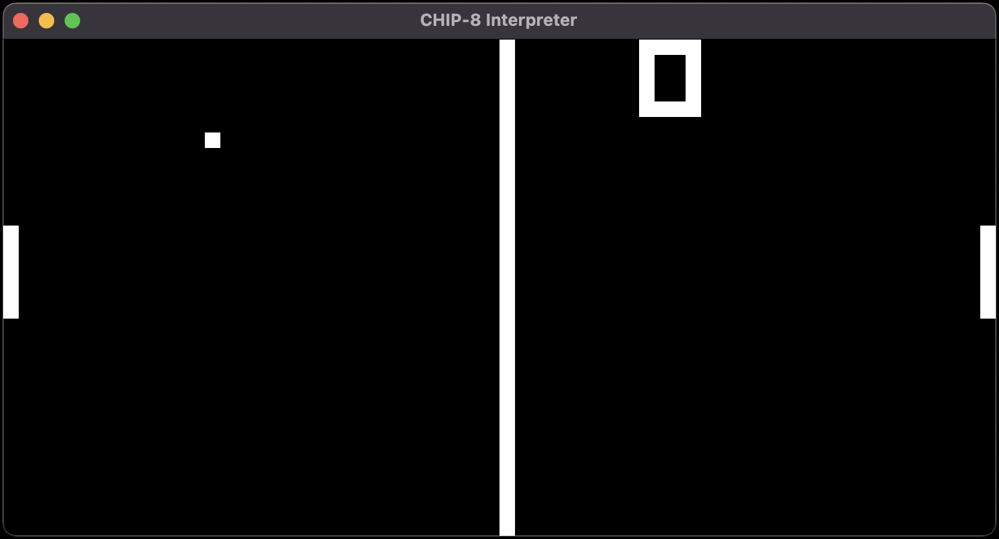

# CHIP-8 Emulator
A fairly simple emulator for CHIP-8 interpreted programming language written in Rust

# About
This is not meant to be very fancy emulator. Its written as practice with the Rust language as well as being my first introduction into innerworkings of languages and CPUs. I wrote most of this code following [this](http://devernay.free.fr/hacks/chip8/C8TECH10.HTM) spec sheet with readability in mind.

<p align="center">
  
</p>

# Running
Should be able to run on most systems, simply run the following commands
```
git clone https://github.com/cosyntxd/CHIP8
cd CHIP8
cargo run --release
```
# Roms
This is only an emulator, see list of ROMs for CHIP8 [here](https://github.com/loktar00/chip8/tree/master/roms).
Specify the target ROM by either dragging and dropping the file into the window or running with `chip8 <FILE>`

# About CHIP-8
Read about it [here](http://devernay.free.fr/hacks/chip8/C8TECH10.HTM#0.0):
```
Chip-8 is a simple, interpreted, programming language which was first used
on some do-it-yourself computer systems in the late 1970s and early 1980s.
The COSMAC VIP, DREAM 6800, and ETI 660 computers are a few examples. These 
computers typically were designed to use a television as a display, had between 
1 and 4K of RAM, and used a 16-key hexadecimal keypad for input. The interpreter 
took up only 512 bytes of memory, and programs, which were entered into the 
computer in hexadecimal, were even smaller.
```
This is done through a virtual machine:
- 4096 bytes of memory
- 16 general purpose 8 bit registers
- 1 special 16 bit register
- Sound and delay timers (audio)
- Program counter and stack pointer psuedo registers 
- Stack of 16 16 bit values
- 16 key hex keyboard (remapped to qwerty)
- 64 x 32 monochrome display

# Building your own
- [Cowgod's Chip-8 Technical Reference](http://devernay.free.fr/hacks/chip8/C8TECH10.HTM#0.1)
- [Mastering CHIP‐8](https://github.com/mattmikolay/chip-8/wiki/Mastering-CHIP%E2%80%908)
- [BUILDING A CHIP-8 EMULATOR [C++]](https://austinmorlan.com/posts/chip8_emulator/)
- [Wikipedia](https://en.wikipedia.org/wiki/CHIP-8)

To compare your own code against this one, launch with the `-d <LEVEL>` option (1-2) to get a log of the internal state of the emulator. It is recommended to redirect stdout to a file.

# Licence
Do as you please with this project, see [LICENSE](LICENSE) for details.